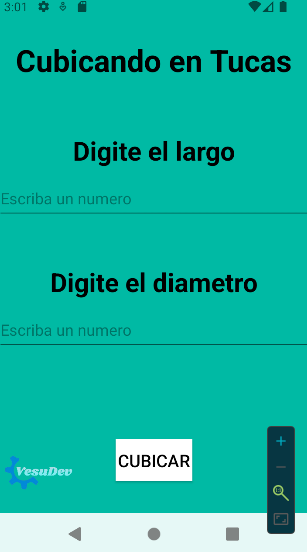

# Cubicador de Madera




Este proyecto es una herramienta desarrollada en Android Studio que permite realizar operaciones de cubicación de madera, facilitando el cálculo de volúmenes y ayudando a profesionales de la industria maderera. Fue creado como una solución práctica para las necesidades de cubicación en el trabajo de campo.

## Características

- Cálculo preciso de volúmenes de madera.
- Interfaz sencilla y fácil de usar.
- Herramienta útil para madereros y profesionales del sector.

## Requisitos

- Android Studio
- SDK de Android

## Instalación

1. Clona el repositorio:
   ```
   git clone https://github.com/Vesubius/Cubicador-De-Madera.git
   ```
2. Abre el proyecto en Android Studio.
3. Ejecuta la aplicación en un emulador o dispositivo Android.

## Uso

Ingresa las dimensiones de las piezas de madera para obtener su volumen total. La aplicación calcula automáticamente la cubicación y muestra los resultados en pantalla.

## Contribuciones

Las contribuciones son bienvenidas. Puedes hacer un fork del repositorio y enviar un pull request con tus mejoras o correcciones.

## Licencia

Este proyecto está licenciado bajo la MIT License.

